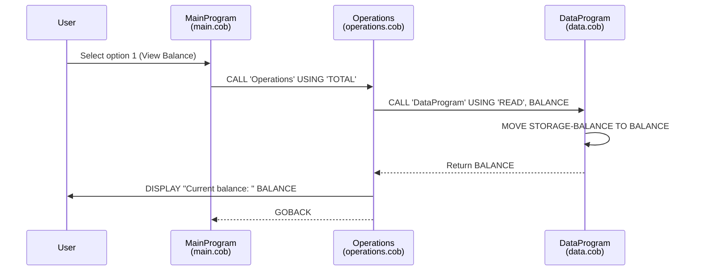
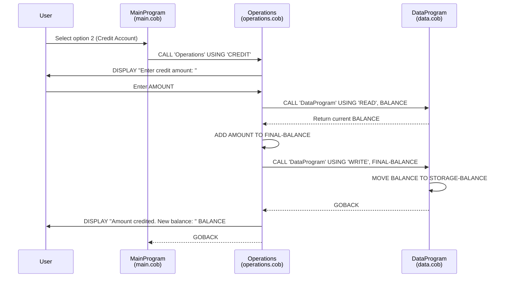
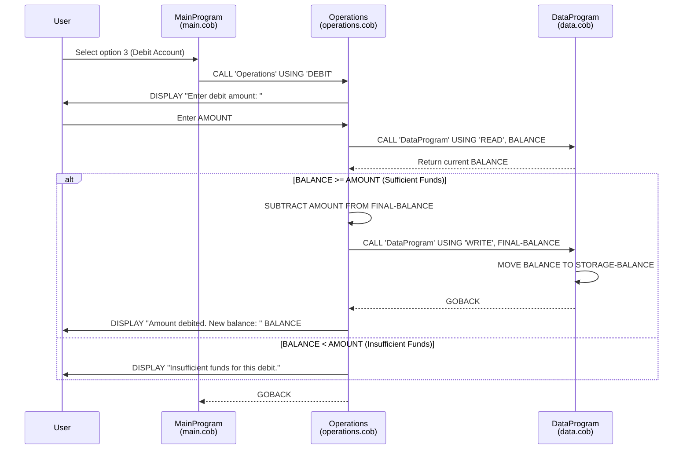
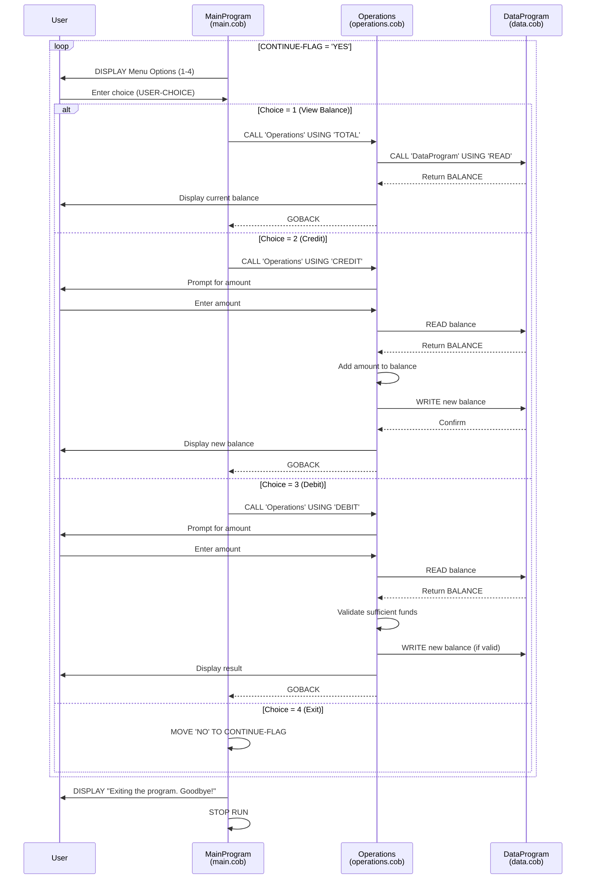

# Student Account Management System - COBOL Documentation

## Overview

This COBOL application is a Student Account Management System that provides basic financial operations for managing student account balances. The system allows users to view balances, credit funds, and debit funds from student accounts.

## File Structure

The application consists of three COBOL source files located in `/src/cobol/`:

| File | Program ID | Description |
|------|------------|-------------|
| `main.cob` | MainProgram | Entry point and user interface |
| `operations.cob` | Operations | Business logic for account operations |
| `data.cob` | DataProgram | Data storage and persistence layer |

---

## File Descriptions

### 1. main.cob (MainProgram)

**Purpose:** Serves as the main entry point for the application and provides the user interface menu.

**Key Functions:**
- Displays the main menu with available options
- Accepts user input for menu selection
- Routes user choices to the appropriate operations
- Controls the main program loop

**Menu Options:**
| Option | Description |
|--------|-------------|
| 1 | View Balance - Display current account balance |
| 2 | Credit Account - Add funds to the account |
| 3 | Debit Account - Withdraw funds from the account |
| 4 | Exit - Terminate the program |

**Data Elements:**
- `USER-CHOICE` (PIC 9) - Stores the user's menu selection
- `CONTINUE-FLAG` (PIC X(3)) - Controls program loop ('YES'/'NO')

---

### 2. operations.cob (Operations)

**Purpose:** Contains the business logic for all account operations including viewing balance, crediting, and debiting funds.

**Key Functions:**

| Operation | Code | Description |
|-----------|------|-------------|
| View Balance | `TOTAL` | Reads and displays the current account balance |
| Credit | `CREDIT` | Adds a specified amount to the account balance |
| Debit | `DEBIT` | Subtracts a specified amount from the account balance |

**Data Elements:**
- `OPERATION-TYPE` (PIC X(6)) - Identifies the operation to perform
- `AMOUNT` (PIC 9(6)V99) - Transaction amount (up to 999,999.99)
- `FINAL-BALANCE` (PIC 9(6)V99) - Working balance variable

**Business Rules:**
1. **Balance Display:** Retrieves current balance from data layer and displays to user
2. **Credit Operation:** Accepts amount, adds to current balance, persists new balance
3. **Debit Operation:** Validates sufficient funds before processing withdrawal

---

### 3. data.cob (DataProgram)

**Purpose:** Acts as the data access layer, managing the persistent storage of the account balance.

**Key Functions:**

| Operation | Code | Description |
|-----------|------|-------------|
| Read | `READ` | Returns the current stored balance |
| Write | `WRITE` | Updates the stored balance with a new value |

**Data Elements:**
- `STORAGE-BALANCE` (PIC 9(6)V99) - Persistent balance storage (default: 1000.00)
- `OPERATION-TYPE` (PIC X(6)) - Identifies read or write operation
- `BALANCE` (PIC 9(6)V99) - Linkage variable for passing balance values

---

## Business Rules

### Student Account Rules

1. **Initial Balance:** All accounts start with a default balance of $1,000.00

2. **Balance Limits:**
   - Maximum balance: $999,999.99 (6 digits + 2 decimal places)
   - Minimum balance: $0.00

3. **Credit Operations:**
   - Any positive amount can be credited to the account
   - No upper limit validation on credit transactions
   - Balance is immediately updated after credit

4. **Debit Operations:**
   - **Insufficient Funds Rule:** Debits cannot exceed the current balance
   - If a debit amount is greater than the available balance, the transaction is rejected with the message: "Insufficient funds for this debit."
   - Successful debits immediately update the balance

5. **Data Persistence:**
   - Balance is stored in working storage (in-memory)
   - Balance persists during program execution
   - Balance resets to default ($1,000.00) on program restart

---

## Program Flow

```
┌─────────────────┐
│   MainProgram   │
│   (main.cob)    │
└────────┬────────┘
         │
         │ CALL 'Operations'
         ▼
┌─────────────────┐
│   Operations    │
│(operations.cob) │
└────────┬────────┘
         │
         │ CALL 'DataProgram'
         ▼
┌─────────────────┐
│  DataProgram    │
│   (data.cob)    │
└─────────────────┘
```

---

## Technical Notes

- **Language:** COBOL (Common Business-Oriented Language)
- **Architecture:** Three-tier design (UI, Business Logic, Data Access)
- **Inter-program Communication:** Uses COBOL CALL statements with USING clause
- **Decimal Handling:** Uses implied decimal (V99) for currency calculations
- **Input/Output:** Console-based using DISPLAY and ACCEPT statements

---

## Future Modernization Considerations

When modernizing this legacy system, consider:

1. **Data Persistence:** Replace in-memory storage with database connectivity
2. **User Interface:** Migrate from console to web-based or API interface
3. **Validation:** Add input validation for transaction amounts
4. **Audit Trail:** Implement transaction logging
5. **Multi-account Support:** Extend to support multiple student accounts
6. **Authentication:** Add user authentication and authorization

---

## Sequence Diagrams

### View Balance Flow



### Credit Account Flow



### Debit Account Flow



### Complete Application Flow


